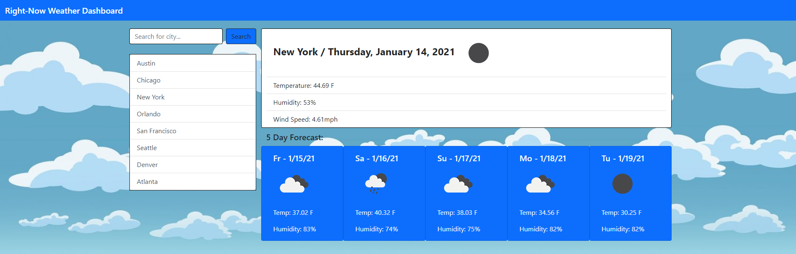

# Weather-Dashboard

## Description

Application is used primarily for checking current weather of a given location and its forecast for the next five days. The user can search for a particular city in the top left searchbar or pick from a list of suggestions under said searchbar. Either choice will result in the main card displaying the city's name, today's date, a weather icon, current temperature in farenheit, humidity, and wind speed in miles per hour. Either choice will also result in the 5 blocks at the bottom displaying another weather icon, the temperature, and humidity of the next five days. Visit site [here](https://josecordova42.github.io/Weather-Dashboard/).

## Usage

## Credits

[Bootstrap](https://getbootstrap.com/)

[Jquery](https://jquery.com/)

[Day.js](https://day.js.org/)

[Stephen Price](https://github.com/stephenlprice) for helping implement Dayjs.

[OpenWeather API](https://openweathermap.org/)

## License

MIT License

Copyright (c) 2021 Jose Cordova

Permission is hereby granted, free of charge, to any person obtaining a copy
of this software and associated documentation files (the "Software"), to deal
in the Software without restriction, including without limitation the rights
to use, copy, modify, merge, publish, distribute, sublicense, and/or sell
copies of the Software, and to permit persons to whom the Software is
furnished to do so, subject to the following conditions:

The above copyright notice and this permission notice shall be included in all
copies or substantial portions of the Software.

THE SOFTWARE IS PROVIDED "AS IS", WITHOUT WARRANTY OF ANY KIND, EXPRESS OR
IMPLIED, INCLUDING BUT NOT LIMITED TO THE WARRANTIES OF MERCHANTABILITY,
FITNESS FOR A PARTICULAR PURPOSE AND NONINFRINGEMENT. IN NO EVENT SHALL THE
AUTHORS OR COPYRIGHT HOLDERS BE LIABLE FOR ANY CLAIM, DAMAGES OR OTHER
LIABILITY, WHETHER IN AN ACTION OF CONTRACT, TORT OR OTHERWISE, ARISING FROM,
OUT OF OR IN CONNECTION WITH THE SOFTWARE OR THE USE OR OTHER DEALINGS IN THE
SOFTWARE.